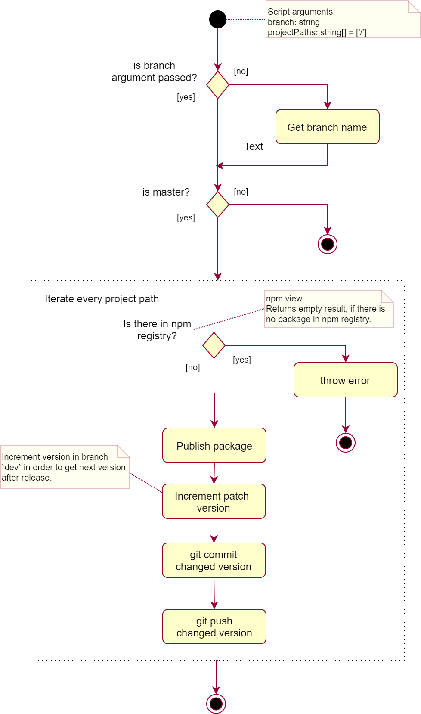
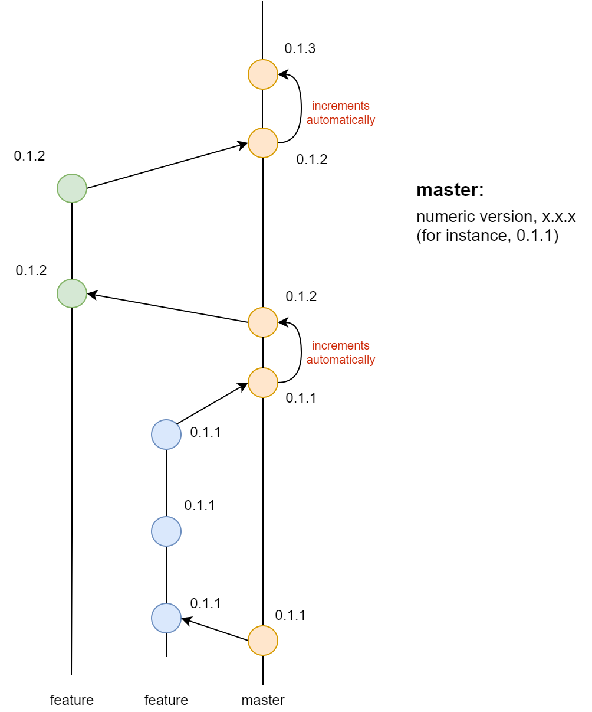

# Versioning

## Version number

Now we do not use semantic versioning due to a lot of breaking changes on current stage of the projects. We only:

1. Set major version to 0
2. Set minor version to 1
3. Increment patch versions number.

Our version strategy now: `0.1.x`, where we change only `x`.

## Developing process

Link: [Diagram. Developing process](https://app.diagrams.net/#G1tMea7PiWRWfQW587hHsOB10qE2KlEyMY)

Versioning in live developing process:

1. Work in branch `dev` / `feature` / ...
2. When you want to publish the release version, merge `feature` branch into branch `master`.
After you update `master` branch CI does the following:
    1. Gets numeric version from `package.json`
    2. Publish package to npm repo
    3. Increment version in `package.json`
    4. Commits updated version.
    **Be sure you set an auto-commit check on CI to prevent an endless loop of commits and CI**
3. Version is incremented automatically if it is already exists (patch version is incremented). 
If version is automatically changed, we have automatically created commit in branch `master`.
If you want, you can set any different version number in `feature` branch before merging to `master`.

## Continuous integration

Link: [Diagram. Publish script](https://app.diagrams.net/#G1tMea7PiWRWfQW587hHsOB10qE2KlEyMY)

Publishing algorithm looks like:

